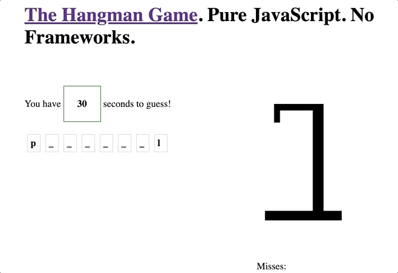

# The Hangman Game. Pure JavaScript. No Frameworks.

## Demo

🚀 [**CHECK IT OUT**](https://vitkarpov.github.io/the-hangman)



- Pure JavaScript. No frameworks.
- Clean non-over engineered code.
- Unit Tests.

## Run locally

```
$ yarn && yarn start
```


Go to `http://localhost:1234`

## Production build

```
$ yarn build
```

All the files end up in `dist` folder, paths are relative.
